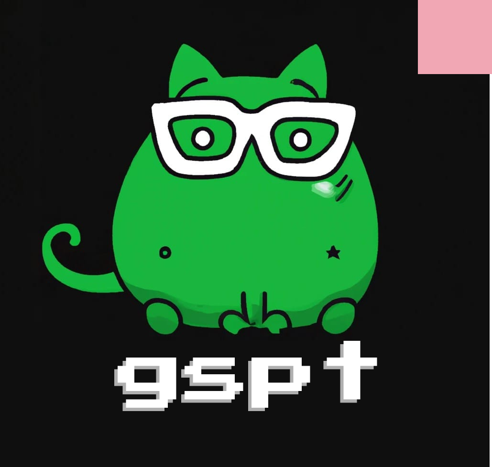
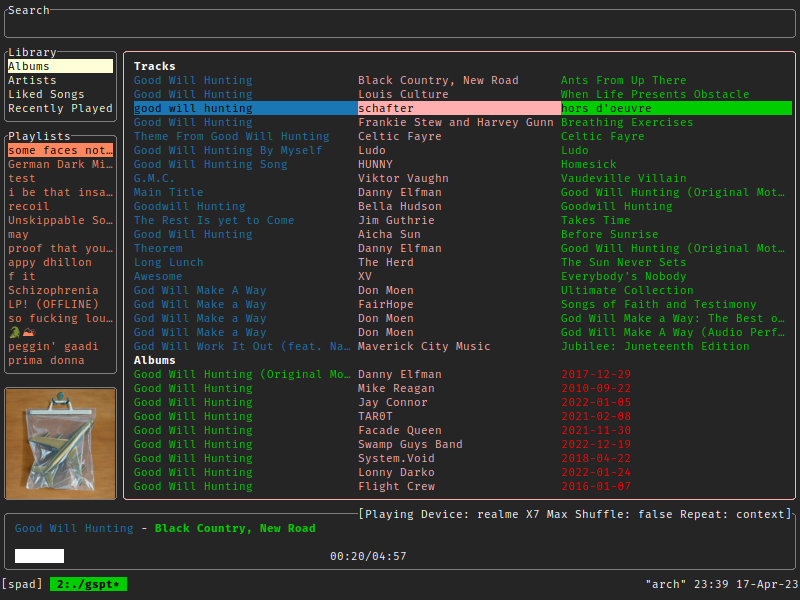
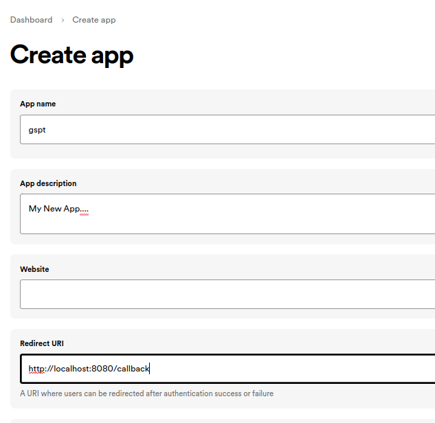
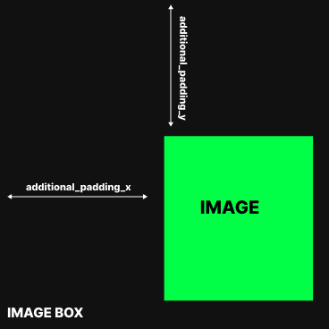
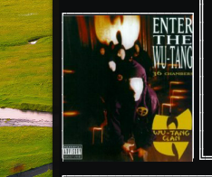

# gspt

<div class="info" align="center">
    <br><br>
    Spotify for terminal written in Go.<br>
    with builtin <b>cover-art view</b> and <b>much more.</b> <br>
    <!-- <a href="https://aditya-K2.github.io/gspt/"> Documentation </a> | -->
    <a href="https://github.com/aditya-K2/gspt/discussions">Discussion</a>
</div>

---



---

***In a very experimental stage.***

### Please Note

- You will need Spotify Premium.
- "gspt" uses the [Web API](https://developer.spotify.com/documentation/web-api)
  from Spotify, which doesn't handle streaming itself. So you'll need either
  an official Spotify client open or a lighter weight alternative such as
  [spotifyd](https://github.com/Spotifyd/spotifyd).
- Images are rendered using the Xorg child windows. Currently there is no support for Wayland.
- Some Terminals even in Xorg don't seem to support Image rendering. (See [Verified Terminals](http://github.com/aditya-K2/gspt#verified-terminals))

## Setup

### Installing

```bash
$ git clone https://github.com/aditya-K2/gspt.git # Cloning
$ cd gspt
$ go build -v # Building
$ sudo install -D gspt -t "/usr/bin/" # Installing

# You can merge them into a one liner
$ git clone https://github.com/aditya-K2/gspt && cd gspt && GOFLAGS="-buildmode=pie -trimpath -mod=readonly -modcacherw" go build -v && sudo install -D gspt -t "/usr/bin/"
```

### Afer Installation Steps

- #### Generate an API Key from Spotify Dashboard


If you want to use Spotify's API to create applications that interact with
their music streaming service, you will need an API key. Here's how you can
generate one from the Spotify Dashboard:

1. Go to the [Spotify Developer Dashboard](https://developer.spotify.com/dashboard/)
and log in with your Spotify account credentials.

2. Click on the "Create an App" button to create a new application.

   

3. Give your application a name and description, and agree to the terms of
   service. In the `Redirect URI` section add `http://localhost:8080/callback`
   as a callback URL. This is necessary for the OAuth 2.0 authentication flow
   to work. Click on "Create" to proceed. 

4. On the next page, you'll see the details of your newly created application.
   In the Settings Look for the section labeled "Client ID" and click on the
   "Show Client Secret" button. You will now see your Client ID and Client
   Secret. You will need both of these to use the Spotify API in "gspt"

- #### Using the Generated Credentials

1. Set the following environment variables from the credentials you generated.

```bash
$ export SPOTIFY_ID= # client id
$ export SPOTIFY_SECRET= # client secret
```

2. After this you can just run `gspt`. And follow the link that it generates, and Login.

```bash
$ gspt
```
---

### Default Key Mappings

1. `d` Opens the device menu to choose a device from
1. `1`, `2`, `3` Switch between the views
1. `Enter` - Selects an entry
1. `?` Search
1. `v` Toggle Visual Mode (Only works in some views)
1. `a` Add to Playlist (Only works in some views)
1. `Ctrl-P` starts playing the entry under the cursor in some views (PlaylistNavigator, Albums, etc.)

## Configuration

The configuration is done through `$XDG_CONFIG_HOME/gspt/config.yml`

Also, Configuration is live updated when you make a change except for the Key Mappings.

#### Config Options

```yml
# Option followed by default values

# Path to where the cached images should be stored.
cache_dir: $XDG_CACHE_HOME

# The amount of milliseconds after which the cover art should be redrawn if there is a event.
redraw_interval: 500

# Image Drawing related options. See next section for an in-detail explanation.
additional_padding_x : 12
additional_padding_y : 16
image_width_extra_x : -1.5
image_width_extra_y : -3.75

# Color configuration has the following api
colors:
    entity:
        fg: # foreground
        bg: # background
        bold: # true/false (boolean)
        italic: # true/false (boolean)

# for e.g
colors:
    artist:
        fg: pink
        bg: black # Would be ignored in most of the cases.
        bold: false
        italic: true

# Key mappings has the following API
mappings:
    view:
    function: key_mapping

# for e.g

mappings:
    recently_played_view:
        open_entry: "ctrl-p"
```

## Image Rendering Related Parameters

The position of the image without any configuration may vary in different
terminals due to font or terminal padding. The app tries to calculate
the position based on rows and columns and font width of you terminal
but the exact position can't be defined. Therefore, it is recommended to define
extra padding and your own image width ratio in the config file.
***Additional Padding*** can be positive or negative and can be used to move the
image up, down, left, or right. ***Extra Image width*** can be adjusted by defining the
extra width to be added or subtracted from the original image width.

<details>
    <p>
        The <code>additional_padding_x</code> and <code>additional_padding_y</code>
        configuration parameters allow you to add extra padding to the placement of
        the image within the terminal window. This additional padding can be set to
        positive or negative values, which will shift the position of the image
        accordingly.
    </p>
    <p>
        Note that the <code>additional_padding_x</code> parameter affects the
        horizontal placement of the image, with negative values shifting the image
        to the right and positive values shifting it to the left. Similarly, the
        <code>additional_padding_y</code> parameter affects the vertical placement
        of the image, with negative values shifting the image up and positive
        values shifting it down.
    </p>
    <p>
        To adjust the <code>additional_padding_x</code> and
        <code>additional_padding_y</code> parameters, simply modify the
        configuration file according to your needs. Keep in mind that adding too
        much padding may cause the image to overlap with other terminal content,
        while adding too little padding may cause the image to be cut off.
        Experiment with different values until you find the perfect placement
        for your image.
    </p>
    <summary><b>Additional Padding</b></summary>
    
</details>
<details>
    <p>
        By default, the app assumes that the image preview box has no font or
        terminal padding or margin, so the image will be rendered at different
        positions in different terminals. To ensure that the image fits
        perfectly within the preview box, you can add extra width to the image
        using the <code>image_width_extra_x</code> and
        <code>image_width_extra_y</code> configuration parameters. These
        parameters can be set to positive or negative values to increase or
        decrease the size of the image, respectively. To add extra width to the
        image, the app takes into account the font width specified by the
        variables.
    </p>
    <p>
        To adjust the <code>image_width_extra_x</code> and
        <code>image_width_extra_y</code> parameters, simply modify the
        configuration file according to your needs. Note that these parameters
        act like a chunk that is either added or subtracted from the original
        image width. Therefore, if the image is flowing outside the preview
        box, you may need to adjust the parameters to increase or decrease the
        chunk size until the image fits perfectly within the box.
    </p>
    <summary><b>Extra Image Width</b></summary>
    
</details>

---

### Configuring Additional Padding and Image Width.


Let's say upon opening "gspt" for the first time and your image is rendered this way.

Here the `Y` Position is too low hence we have to decrease the
`additional_padding_y` so that image will be rendered in a better position so
we decrement the  `additional_padding_y` by 9

Now the configuration becomes
```yml
additional_padding_y : 9
```

and the image appears like this:



One might be happy the way things turn out but for a perfectionist like me this
is not enough. You can notice that the Height of the image is a little bit more
than the box height and hence the image is flowing outside the box. Now it's
time to change the `image_width_extra_y`.

Width can be changed by defining the `image_width_extra_y` and
`image_width_extra_x` it act's a little differently think of it like a chunk
which is either added or subtracted from the image's original width. We can
look at the configuration and realize that the chunk `image_width_extra_y` when
subtracted from the original `image_width` doesn't get us the proper result and
is a little to low. We need to subtract a more bigger chunk, Hence we will
increase the magnitude of `image_width_extra_y` or decrease
`image_width_extra_y`

Now the Configuration becomes:
```yml
image_width_extra_y : -3.2
```
and the image appears like this:


Which looks perfect. 🎉

## Roadmap

- [ ] Multiple Image rendering backends
    - [ ] Sixel
    - [ ] tview Images
    - [ ] Kitty Images
- [ ] Rounded Corners
- [ ] Customisable UI
- [ ] Wayland Support for Image rendering
- [ ] Queue Support
- [ ] Windows Support
- [x] Key Mappings

### Verified Terminals

| Terminal        | Status |
|------------     |--------|
| Alacritty       |   ✅   |
| ST              |   ✅   |
| Xterm           |   ✅   |
| Konsole         |   ✅   |
| Urxvt           |   ✅   |
| xfce-terminal   |   ❌   |
| gnome-terminal  |   ❌   |

### Special thanks to

- [spotify-tui](https://github.com/Rigellute/spotify-tui)
