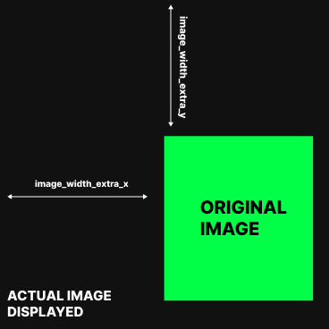
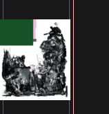
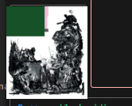
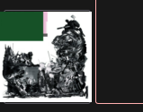
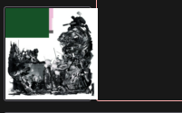
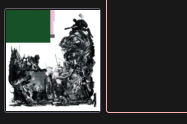

# gspt

<div class="info" align="center">
    <br><br>
    Spotify for terminal written in Go.<br>
    with builtin <b>cover-art view</b> and <b>much more.</b> <br>
    <!-- <a href="https://aditya-K2.github.io/gspt/"> Documentation </a> | -->
    <a href="https://github.com/aditya-K2/gspt/discussions">Discussion</a>
</div>

---


---

***In a very experimental stage.***

### Please Note

- You will need Spotify Premium.
- `gspt` uses the [Web API](https://developer.spotify.com/documentation/web-api)
  from Spotify, which doesn't handle streaming itself. So you'll need either
  an official Spotify client open or a lighter weight alternative such as
  [spotifyd](https://github.com/Spotifyd/spotifyd).
- Images are rendered using the X child windows. Currently there is ***no support*** for Wayland.
- Everything except **Image Rendering** works on Windows and Mac

## Table of Contents
  * [Setup](#setup)
    + [Installing](#installing)
    + [Afer Installation Steps](#afer-installation-steps)
    + [Default Key Mappings](#default-key-mappings)
  * [Command-line Parameters](#command-line-parameters)
  * [Configuration](#configuration)
  * [Image Rendering Related Parameters](#image-rendering-related-parameters)
    + [Configuring Additional Padding and Image Width.](#configuring-additional-padding-and-image-width)

## Setup

### Installing

###### AUR [](https://aur.archlinux.org/packages/gspt-git/)

```bash
$ yay -S gspt-git
```

###### Manually

```bash
# If you have Go Path set up you can directly install gspt using
$ go install github.com/aditya-K2/gspt

# Alternately
$ git clone https://github.com/aditya-K2/gspt.git # Cloning
$ cd gspt
$ go build -v # Building
$ sudo install gspt -t "/usr/bin/" # Linux/Mac

# You can merge this into a one liner
$ git clone https://github.com/aditya-K2/gspt && cd gspt && GOFLAGS="-buildmode=pie -trimpath -mod=readonly -modcacherw" go build -v && sudo install -D gspt -t "/usr/bin/"
```

### Afer Installation Steps

#### Generate an API Key from Spotify Dashboard


If you want to use Spotify's API to create applications that interact with
their music streaming service, you will need an API key. Here's how you can
generate one from the Spotify Dashboard:

1. Go to the [Spotify Developer Dashboard](https://developer.spotify.com/dashboard/)
and log in with your Spotify account credentials.

2. Click on the "Create an App" button to create a new application.

   

3. Give your application a name and description, and agree to the terms of
   service. In the `Redirect URI` section add `http://localhost:8080/callback`
   as a callback URL. This is necessary for the OAuth 2.0 authentication flow
   to work. Click on "Create" to proceed. 

4. On the next page, you'll see the details of your newly created application.
   In the Settings Look for the section labeled "Client ID" and click on the
   "Show Client Secret" button. You will now see your Client ID and Client
   Secret. You will need both of these to use the Spotify API in "gspt"

#### Using the Generated Credentials

1. Set the following environment variables from the credentials you generated.

```bash
# Add this to ~/.bashrc (or your $SHELL equivalent)
export SPOTIFY_ID= # client id
export SPOTIFY_SECRET= # client secret
```

2. After this you can just run `gspt`. And follow the link that it generates, and Login.

```bash
$ gspt
```
---

### Default Key Mappings

1. `d` Open the device menu to choose a device from
1. `1`, `2`, `3` Switch between the views
1. `enter` - Select an entry
1. `?` Search
1. `v` Toggle Visual Mode (Only works in some views)
1. `a` Add to Playlist (Only works in some views)
1. `ctrl-p` Start playing the entry under the cursor in some views (PlaylistNavigator, Albums, etc.)
1. ` ` Toggle Playback (Space)
1. `o` Open the Current Track's Album
1. `O` Open the Current Track's Artist
1. `ctrl-o` Open the Current Context (Album/Artist/Playlist)
1. `n` Play Next Song in Queue
1. `p` Play Previous Song in Queue

## Command-line Parameters

```
NOTE: Command-line flags take priority over config values.

Usage of ./gspt:
  -c string
        Specify The Directory to check for config.yml file. (default "$XDG_CONFIG_HOME/gspt")
  -hide-image
        Do not display the cover art image.
  -rounded-corners
        Enable Rounded Corners
```

## Configuration

The configuration is done through `$XDG_CONFIG_HOME/gspt/config.yml`
or the path to the folder provided by the `-c` flag before starting the app.
See [Command-line Parameters](#command-line-parameters)

Also, Configuration is live updated when you make a change except for some parts
*(Key Mappings, Border Colors)*.

#### Config Parameters

```yml
# Parameter followed by default values
# For the default configuration used by gspt please see:
# https://github.com/aditya-K2/gspt/blob/master/extras/CONFIG.md

# Path to where the cached images should be stored.
cache_dir: $XDG_CACHE_HOME

# The amount of milliseconds after which the cover art should be redrawn if there is a event.
redraw_interval: 500

# Do not display the cover art image.
hide_image: false

# Enable Rounded Corners
rounded_corners: false

# Image Drawing related parameters. See next section for an in-detail explanation.
additional_padding_x : 0
additional_padding_y : 0
image_width_extra_x  : 0
image_width_extra_y  : 0

---

# Color configuration has the following api
colors:
    entity:
        fg: # foreground (Can be Hex value or a color name)
        bg: # background (Can be Hex value or a color name)
        bold: # true/false (boolean)
        italic: # true/false (boolean)

# for e.g
colors:
    artist:
        fg: "#ff0000"
        bg: black # Background will be ignored in most cases. (Terminals default background color is used)
        bold: false
        italic: true

# For the default colors used for the "entities" please see:
# https://github.com/aditya-K2/gspt/blob/master/extras/CONFIG.md
# Available color names (i.e. pink, green, etc.) can be seen here:
# https://github.com/gdamore/tcell/blob/main/color.go#L845

---

# Key mappings has the following API
mappings:
    view:
        mode: # normal/visual
            function: key_mapping

# for e.g
mappings:
    recently_played_view:
        normal:
            play_entry: "ctrl-p"
        visual:
            add_to_playlist: "a"

# "global" mappings are special mappings that are not view specific
# ( "toggle_playback", "next", "previous", etc.)
# These mappings can be changed for different views.
# for e.g

mappings:
    global:
        normal:
            previous: "N"
    recently_played_view:
        normal:
            previous: "P"

# As you can assume, here "N" will be globally mapped to the "previous" function,
# and then "P" will too be mapped to "previous" in the recently_played_view (keep
# in mind that "N" will still be mapped to the "previous" function i.e "N" and
# "P" will both be mapped to the same function in recently_played_view)

# Visual Mode is similar to vim. Only some views support it.
# (viz. playlist_view, recently_played_view, liked_songs_view, album_view)

# For the default mappings for each view please see:
# https://github.com/aditya-K2/gspt/blob/master/extras/CONFIG.md
```

## Image Rendering Related Parameters

The position of the image without any configuration may vary in different
terminals due to font or terminal padding. The app tries to calculate
the position based on rows and columns and font width of you terminal
but the exact position can't be defined. Therefore, it is recommended to define
extra padding and your own image width ratio in the config file.
***Additional Padding*** can be positive or negative and can be used to move the
image up, down, left, or right. ***Extra Image width*** can be adjusted by defining the
extra width to be added or subtracted from the original image width.

<details>
    <p>
        The <code>additional_padding_x</code> and <code>additional_padding_y</code>
        configuration parameters allow you to add extra padding to the placement of
        the image within the terminal window. This additional padding can be set to
        positive or negative values, which will shift the position of the image
        accordingly.
    </p>
    <p>
        Note that the <code>additional_padding_x</code> parameter affects the
        horizontal placement of the image, with negative values shifting the image
        to the right and positive values shifting it to the left. Similarly, the
        <code>additional_padding_y</code> parameter affects the vertical placement
        of the image, with negative values shifting the image up and positive
        values shifting it down.
    </p>
    <p>
        To adjust the <code>additional_padding_x</code> and
        <code>additional_padding_y</code> parameters, simply modify the
        configuration file according to your needs. Keep in mind that adding too
        much padding may cause the image to overlap with other terminal content,
        while adding too little padding may cause the image to be cut off.
        Experiment with different values until you find the perfect placement
        for your image.
    </p>
    <summary><b>Additional Padding</b></summary>
    
</details>
<details>
    <p>
        By default, the app assumes that the image preview box has no font or
        terminal padding or margin, so the image will be rendered at different
        positions in different terminals. To ensure that the image fits
        perfectly within the preview box, you can add extra width to the image
        using the <code>image_width_extra_x</code> and
        <code>image_width_extra_y</code> configuration parameters. These
        parameters can be set to positive or negative values to increase or
        decrease the size of the image, respectively. To add extra width to the
        image, the app takes into account the font width specified by the
        variables.
    </p>
    <p>
        To adjust the <code>image_width_extra_x</code> and
        <code>image_width_extra_y</code> parameters, simply modify the
        configuration file according to your needs. Note that these parameters
        act like a chunk that is either added or subtracted from the original
        image width. Therefore, if the image is flowing outside the preview
        box, you may need to adjust the parameters to increase or decrease the
        chunk size until the image fits perfectly within the box.
    </p>
    <summary><b>Extra Image Width</b></summary>
    
</details>

---

### Configuring Additional Padding and Image Width.

###### Please read about [Image Rendering Related Parameters](#image-rendering-related-parameters) first.

Let's say upon opening "gspt" for the first time and your image is rendered this way.



Here, the image is placed too high, so we will start by adding
`additional_padding_y` so that it will be moved down.

The configuration becomes:

```yml
additional_padding_y: 36 # you will need to use trial and error
```
and the image appears like this:



Now the image overflows the image box, we need to decrease the image's width, hence
will change `image_width_extra_y` first

```yml
image_width_extra_y : -16
```



Now the image  overflows from the left side, hence we will change `additional_padding_x`
to move the image to the right

```yml
additional_padding_x: 6
```



The last thing we will do is to decrease the `image_width_extra_x` so that it will
be placed correctly in the box

```yml
image_width_extra_x : -8
```



Which looks perfect. 🎉

---

### Special thanks to [spotify-tui](https://github.com/Rigellute/spotify-tui)
