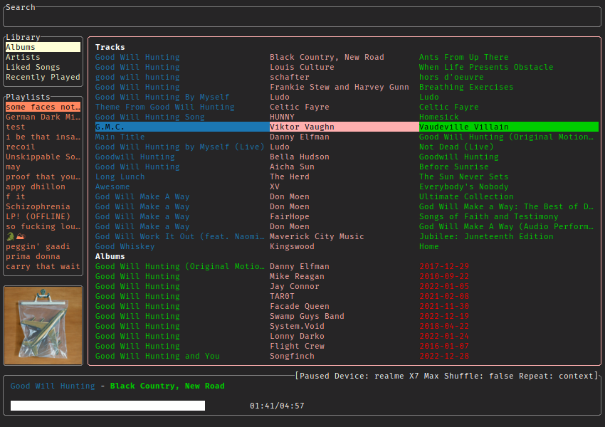
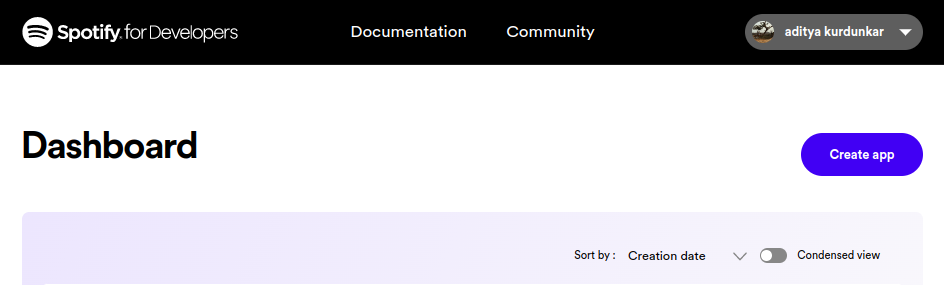

# gspt

<div class="info" align="center">
    <br><br>
    Spotify for terminal written in Go.<br>
    with builtin <b>cover-art view</b> and <b>much more.</b> <br>
    <!-- <a href="https://aditya-K2.github.io/gspt/"> Documentation </a> | -->
    <a href="https://github.com/aditya-K2/gspt/discussions">Discussion</a>
</div>

---



---

***In a very experimental stage.***

### Building

```bash
$ git clone https://github.com/aditya-K2/gspt.git
$ cd gspt
$ go build -v
```

### Installing

```bash
$ sudo install -D gspt -t "/usr/bin/"
```

#### You can merge them into a one liner

```bash
git clone https://github.com/aditya-K2/gspt && cd gspt && GOFLAGS="-buildmode=pie -trimpath -mod=readonly -modcacherw" go build -v && sudo install -D gspt -t "/usr/bin/"
```

### Please Note

- You will need Spotify Premium to use `gspt`.
- `gspt` uses the [Web API](https://developer.spotify.com/documentation/web-api) from Spotify, which doesn't handle streaming itself. So you'll need either an official Spotify client open or a lighter weight alternative such as [spotifyd](https://github.com/Spotifyd/spotifyd).
- Images are rendered using the Xorg child windows. Currently there is no support for Wayland.
- Some Terminals even in Xorg don't seem to support Image rendering.
    - Following terminals have been tested with:
        - Alacritty
        - ST
        - Urxvt

## Setup

### How to Generate an API Key from Spotify Dashboard


If you want to use Spotify's API to create applications that interact with their music streaming service, you will need an API key. Here's how you can generate one from the Spotify Dashboard:

1. Go to the [Spotify Developer Dashboard](https://developer.spotify.com/dashboard/) and log in with your Spotify account credentials.

2. Click on the "Create an App" button to create a new application.

   

3. Give your application a name and description, and agree to the terms of service. In the `Redirect URI` section add `http://localhost:8080/callback` as a callback URL. This is necessary for the OAuth 2.0 authentication flow to work. Click on "Create" to proceed.
   

4. On the next page, you'll see the details of your newly created application. In the Settings Look for the section labeled "Client ID" and click on the "Show Client Secret" button.

5. You will now see your Client ID and Client Secret. You will need both of these to use the Spotify API in `gspt`

```bash
$ export SPOTIFY_ID= # client id
$ export SPOTIFY_SECRET= # client secret
```

7. After this you can just run `gspt`. And follow the link that it generates, and Login.

```bash
$ gspt
```

---

## Key bindings

1. `d` Opens the device menu to choose a device from
1. `1`, `2`, `3` Switch between the views
1. `Enter` - Selects an entry
1. `?` Search
1. `v` Toggle Visual Mode (Only works in some views)
1. `a` Add to Playlist (Only works in some views)
1. `Ctrl-P` starts playing the entry under the cursor in some views (PlaylistNavigator, Albums, etc.)

## Config Options

Config file can be defined at `$HOME/.config/gspt/config.yaml`

Note: Configuration is live updated when you make a change

#### Following Options are configurable

```yml
# Following are the default values
cache_dir: $XDG_CACHE_HOME # Path to where the cached images should be stored.
redraw_interval: 500
additional_padding_x : 12
additional_padding_y : 16
image_width_extra_x : -1.5
image_width_extra_y : -3.75
colors:
    artist:
        fg: pink
        bg: ""
        bold: false
        italic: false
    album:
        fg: green
        bg: ""
        bold: false
        italic: false
    track:
        fg: blue
        bg: ""
        bold: false
        italic: false
    genre:
        fg: darkCyan
        bg: ""
        bold: true
        italic: false
    timestamp:
        fg: red
        bg: ""
        bold: false
        italic: true
    pbar_artist:
        fg: blue
        bg: ""
        bold: true
        italic: false
    pbar_track:
        fg: green
        bg: ""
        bold: true
        italic: true
    playlist_nav:
        fg: coral
        bg: ""
        bold: false
        italic: false
    nav:
        fg: papayawhip
        bg: ""
        bold: false
        italic: false
    context_menu:
        fg: turquoise
        bg: ""
        bold: true
        italic: false
```

### Key Mappings

```yaml

# Key mappings has the following API

# mappings:
#     view:
#     function: mapping

# for e.g

mappings:
    recently_played_view:
        open_entry: "ctrl-p"

# Following Views and Functions are currently available
# To see available keys please see: https://github.com/aditya-K2/gspt/blob/master/config/key.go#L13
mappings:
    album_view:
        open_entry
    albums_view:
        open_entry
        play_entry
    artist_view:
        open_entry
        play_entry
    artists_view:
        open_entry
    liked_songs_view:
        open_entry
    playlist_nav:
        open_entry
        play_entry
    playlist_view:
        open_entry
    search_view:
        open_entry
    recently_played_view:
        open_entry
    top_tracks_view:
        open_entry
        play_entry
    # These mappings are available in every view.
    global:
        focus_search
        focus_main_view
        focus_playlists
        focus_nav
        choose_device
```

## Roadmap

- [ ] Multiple Image rendering backends
    - [ ] Sixel
    - [ ] tview Images
    - [ ] Kitty Images
- [ ] Rounded Corners
- [ ] Customisable UI
- [ ] Wayland Support for Image rendering
- [ ] Queue Support
- [x] Key Mappings

